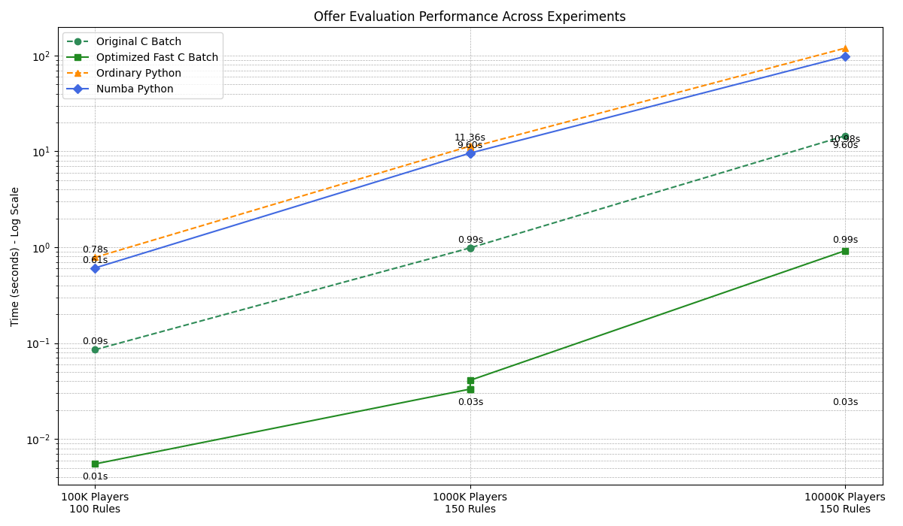

HybridRuleEngine - Offer Evaluation Performance Report

## 📂 Directory Structure

```
HybridRuleEngine/
├── config/
│   └── rules_config.json
├── data/
│   ├── player_data.csv
│   ├── offer_decisions.csv  # Output for ordinary (src)
│   ├── offer_decisions_fast.csv  # Output for optimized (src2)
│   ├── evaluation_metrics.csv  # Metrics for ordinary (src)
│   ├── evaluation_metrics_fast.csv  # Metrics for optimized (src2)
│   ├── evaluation_metrics_full.csv  # All methods including Numba
├── lib/
│   └── librules.dylib  # Compiled library
├── src/                  # Ordinary Hybrid Engine (C Batch + Python)
│   ├── main.py
│   ├── rules.c
│   ├── rules.h
│   ├── Makefile
├── src2/                 # Optimized Hybrid Engine (Fast C Batch + Python + Numba)
│   ├── main.py
│   ├── rules.c
│   ├── rules.h
│   ├── Makefile
├── visualizations/
│   ├── offer_distribution.png
│   ├── experiment_performance_comparison.png
```

---

## 📊 Experimental Results

### Ordinary C Batch vs Python

| Metric                | Value                  |
|----------------------|---------------------|
| C Duration (s)       | 0.0855             |
| Python Duration (s)  | 0.7848             |
| Number of Players    | 100000              |
| Number of Rules      | 100                  |

---

### Ordinary C Batch vs Python

| Metric                | Value                  |
|----------------------|---------------------|
| C Duration (s)       | 0.9861             |
| Python Duration (s)  | 11.3552           |
| Number of Players    | 1000000            |
| Number of Rules      | 150                  |

---

### 3rd Experiment Ordinary C Batch vs Python

| Metric                | Value                  |
|----------------------|---------------------|
| C Duration (s)       | 14.5382            |
| Python Duration (s)  | 119.4559          |
| Number of Players    | 10000000         |
| Number of Rules      | 150                  |

---

### Fast C Batch vs Ordinary Python

| Metric                          | Value                  |
|----------------------|---------------------|
| Fast C Batch Duration (s)   | 0.0332             |
| Ordinary Python Duration (s) | 10.9832            |
| Number of Players          | 1000000            |
| Number of Rules            | 150                  |

---

### Fast C Batch vs Numba Python

| Metric                          | Value                  |
|----------------------|---------------------|
| Fast C Batch Duration (s)   | 0.0410             |
| Numba Python Duration (s)  | 9.6022             |
| Number of Players          | 1000000            |
| Number of Rules            | 150                  |

---

## 📉 Performance Visualization

### Performance Comparison Plot

📊 This plot compares Ordinary Python, Numba Python, Ordinary C Batch, and Fast C Batch across different player counts and rule complexities.

`visualizations/experiment_performance_comparison.png`

---

## Summary

- `src/` contains the **Ordinary Hybrid Engine** — direct batch call to C from Python.
- `src2/` contains the **Optimized Hybrid Engine** — improved with:
    - In-C parallelism (OpenMP)
    - Vectorization hints
    - Integer offer handling (no string manipulation)
    - Numba-accelerated Python option


